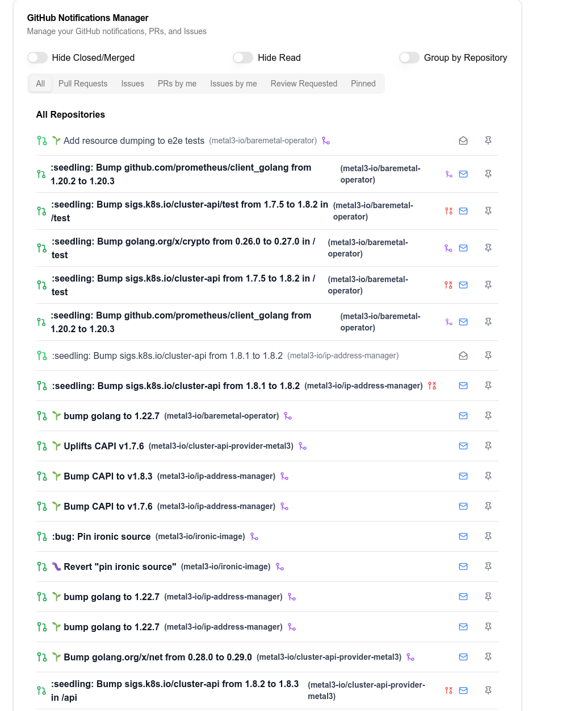

# GitHub Notification Manager



GitHub Notification Manager is a opinionated manager for Github notifications.

The default Github Notifications at github.com/notifications just throws a bunch of
activities at us, without any grouping and very limited filtering. There's no option
to see the list of PRs/Issues that the notifications came from, nor options to filter
out merged/closed topics.

This project offers a more pleasant way to look at the list of notifications, by offering
all of the above. With it, my pages of GH notifications was reduced to about one screen
height, which allows me to not miss the important notifications.

## Step-by-step instruction

- Accquire a Github token: [Read more here](https://docs.github.com/en/authentication/keeping-your-account-and-data-secure/managing-your-personal-access-tokens)
- Create a `.env` file at the root of the repository, with content

```
GITHUB_TOKEN=<your-gh-token>
```

- Run `docker compose up -d`

- Open the app on url address `localhost:8899`
